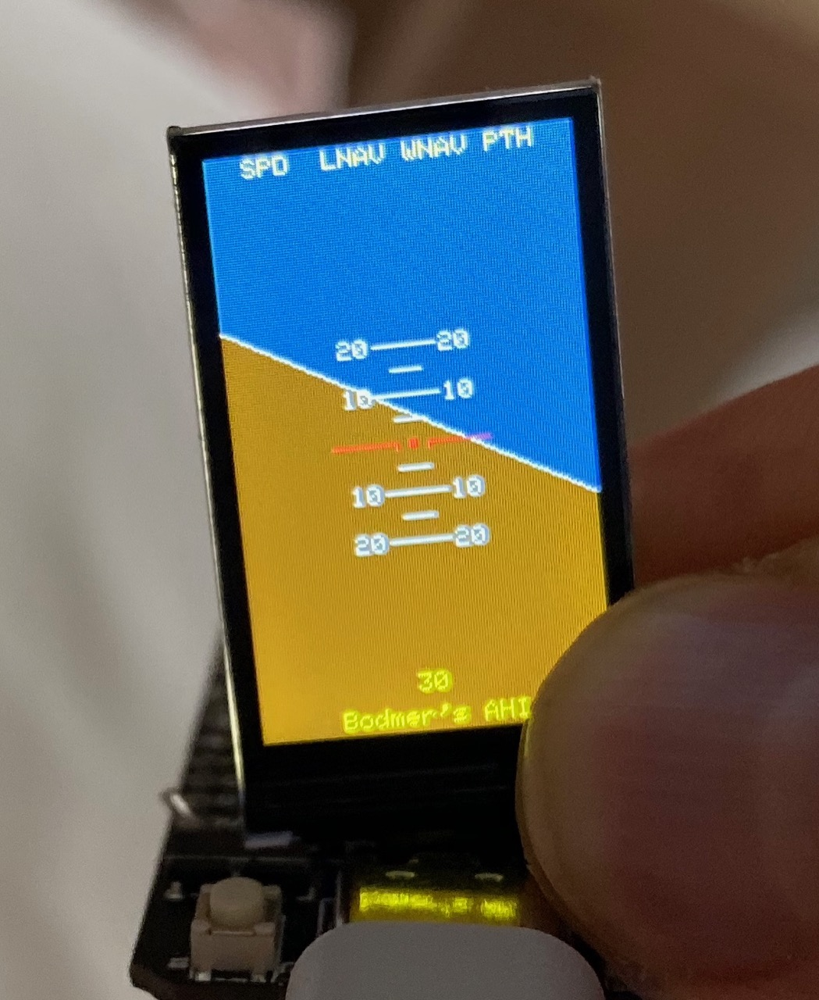

# ahizon
An artificial horizon indicator using esp32, tft screen, mpu9250 w/ DMP for quaternions.

Developed, compiled and uploaded using [PlatformIO](https://platformio.org) with [Arduino framework](https://docs.platformio.org/en/latest/platforms/espressif32.html) in [Visual Studio Code](https://code.visualstudio.com).

## credits
This is mostly a merge between Kris Wiener's https://github.com/kriswiner/MPU9250/blob/master/MPU9250BasicAHRS.ino and [Bodmer](https://github.com/Bodmer)'s https://forum.arduino.cc/index.php?action=dlattach;topic=417918.0;attach=177585.